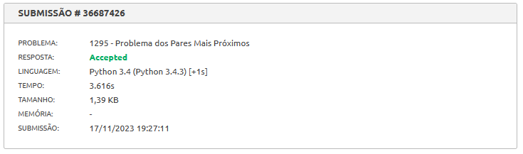

# Dividir e Conquistar Exercícios Resolvidos

**Conteúdo da Disciplina**: Dividir e Conquistar<br>

## Alunos
| Matrícula  | Aluno                                                        |
| ---------- | ------------------------------------------------------------ |
| 19/0089601 | [João Lucas Pinto Vasconcelos](https://github.com/HacKairos) |

## Sobre 
Meu projeto se trata sobre a resolução de alguns exercícios no juiz online, nessa entrega fiz 3 exercicios, sendo 2 do LeetCode e 1 do beecrowd, tentando chegar em uma resolução utilizando os algoritmos apresentados no decorrer das aulas de Dividir e Conquistar, os exercicios escolhidos e suas respectivas dificuldades foram :

[Median of Two Sorted Arrays](https://leetcode.com/problems/median-of-two-sorted-arrays/description/): Dificil

[Find the Kth Largest Integer in the Array](https://leetcode.com/problems/find-the-kth-largest-integer-in-the-array/description/): Mediana

[Problema dos Pares Mais Próximos](https://www.beecrowd.com.br/judge/pt/problems/view/1295): 9 em uma escala de 10

## Video
Para o video eu disponibilizei no repositorio com uma qualidade bem duvidoso e bem acelerado devido limitações do github, e disponibilizei o video no Youtube.

[Repositorio](video/video.mp4)

[Youtube](https://youtu.be/)

## Resultados

### [Median of Two Sorted Arrays](https://leetcode.com/problems/median-of-two-sorted-arrays/description/)


### [Find the Kth Largest Integer in the Array](https://leetcode.com/problems/find-the-kth-largest-integer-in-the-array/description/)


### [Problema dos Pares Mais Próximos](https://www.beecrowd.com.br/judge/pt/problems/view/1295)



## Instalação 
**Linguagem**: Python<br>
Apenas será necessário criar um arquivo de entrada de acordo com os exemplos de cada exercício e utilizar o seguinte comando:

```bash
python arquivo.py < entrada.txt
```

## Solução

### [Median of Two Sorted Arrays](src/median-of-two-sorted-arrays.py)
```python
class Solution(object):
    def findmom(self, array):
        # Se o array tiver 5 ou menos elementos, simplesmente ordenamos e retornamos a mediana
        if len(array) <= 5:
            array.sort()
            return array[len(array)//2]
        else:
            # Caso contrário, dividimos o array em grupos de 5, encontramos a mediana de cada grupo,
            # e recursivamente encontramos a mediana das medianas
            medians = [self.findmom(array[i:i+5]) for i in range(0, len(array), 5)]
            return self.findmom(medians)
    
    def findkth(self, array, k):
        # Encontramos a mediana do array
        median = self.findmom(array)
        # Dividimos o array em três partes: elementos menores que a mediana (L),
        # elementos iguais à mediana (M) e elementos maiores que a mediana (R)
        L, M, R = [], [], []
        for num in array:
            if num < median:
                L.append(num)
            elif num > median:
                R.append(num)
            else:
                M.append(num)
        # Se k está dentro do intervalo de L, procuramos o k-ésimo menor elemento em L
        if k < len(L):
            return self.findkth(L, k)
        # Se k está dentro do intervalo de L+M, retornamos a mediana
        elif k < len(L) + len(M):
            return M[0]
        # Se k está dentro do intervalo de L+M+R, procuramos o (k-len(L)-len(M))-ésimo menor elemento em R
        else:
            return self.findkth(R, k-len(L)-len(M))

    def findMedianSortedArrays(self, nums1, nums2):
        size = len(nums1) + len(nums2)
        # Se o tamanho total é par, encontramos os dois elementos do meio e retornamos a média deles
        if size % 2 == 0:
            mid1 = self.findkth(nums1+nums2, size//2 - 1)
            mid2 = self.findkth(nums1+nums2, size//2)
            return (mid1 + mid2) / 2.0
        # Se o tamanho total é ímpar, encontramos o elemento do meio e o retornamos
        else:
            return self.findkth(nums1+nums2, size//2)
```

#### Explicação

A classe Solution é definida com três métodos: findmom, findkth e findMedianSortedArrays.

O método findmom é usado para encontrar a mediana de um array. Se o array tiver 5 ou menos elementos, ele simplesmente ordena o array e retorna a mediana. Caso contrário, ele divide o array em grupos de 5, encontra a mediana de cada grupo e recursivamente encontra a mediana das medianas.

O método findkth é usado para encontrar o k-ésimo menor elemento em um array. Primeiro, ele encontra a mediana do array usando o método findmom. Em seguida, divide o array em três partes: elementos menores que a mediana (L), elementos iguais à mediana (M) e elementos maiores que a mediana (R). Se k está dentro do intervalo de L, ele procura o k-ésimo menor elemento em L. Se k está dentro do intervalo de L+M, ele retorna a mediana. Se k está dentro do intervalo de L+M+R, ele procura o (k-len(L)-len(M))-ésimo menor elemento em R.

O método findMedianSortedArrays é usado para encontrar a mediana de dois arrays ordenados. Ele concatena os dois arrays e calcula o tamanho total. Se o tamanho total é par, ele encontra os dois elementos do meio e retorna a média deles. Se o tamanho total é ímpar, ele encontra o elemento do meio e o retorna.


### [Find the Kth Largest Integer in the Array](src/find-the-kth-largest-integer-in-the-array.py)
```python
class Solution(object):
    def kthLargestNumber(self, nums, k):
        nums = [int(num) for num in nums]  # Converte strings para inteiros
        # Encontra o k-ésimo maior número e o converte de volta para string
        return str(self.findkth(nums, len(nums)-k))

    def findmom(self, array):
        # Se o array tiver 5 ou menos elementos, ordena e retorna a mediana
        if len(array) <= 5:
            array.sort()
            return array[len(array)//2]
        else:
            # Caso contrário, divide o array em grupos de 5 e encontra a mediana de cada grupo
            medians = []
            for i in range(0, len(array), 5):
                group = array[i:i+5]
                medians.append(self.findmom(group))
            # Encontra a mediana das medianas recursivamente
            return self.findmom(medians)
    
    def findkth(self, array, k):
        # Se o array tiver 5 ou menos elementos, ordena e retorna o k-ésimo elemento
        if len(array) <= 5:
            array.sort()
            return array[k]  # Retorna o k-ésimo menor número
        else:
            # Caso contrário, encontra a mediana das medianas
            median = self.findmom(array)
        # Particiona o array em três partes: menor que, igual a, e maior que a mediana
        L, M, R = [], [], []
        for i in range(len(array)):
            if array[i] < median:
                L.append(array[i])
            elif array[i] > median:
                R.append(array[i])
            else:
                M.append(array[i])
        # Encontra o k-ésimo elemento na parte apropriada recursivamente
        if k < len(L):
            return self.findkth(L, k)
        elif k < len(L) + len(M):
            return M[0]
        else:
            return self.findkth(R, k-len(L)-len(M))
    
```

#### Explicação

A classe Solution é definida com três métodos: kthLargestNumber, findmom e findkth.

O método kthLargestNumber é usado para encontrar o k-ésimo maior número em uma lista de números. Primeiro, ele converte todos os números de string para inteiros. Em seguida, ele chama o método findkth para encontrar o k-ésimo maior número, que é equivalente a encontrar o (len(nums)-k)-ésimo menor número. Finalmente, ele converte o número de volta para string antes de retorná-lo.

O método findmom é usado para encontrar a mediana de um array. Se o array tiver 5 ou menos elementos, ele simplesmente ordena o array e retorna a mediana. Caso contrário, ele divide o array em grupos de 5, encontra a mediana de cada grupo e recursivamente encontra a mediana das medianas.

O método findkth é usado para encontrar o k-ésimo menor elemento em um array. Primeiro, ele verifica se o array tem 5 ou menos elementos. Se sim, ele ordena o array e retorna o k-ésimo elemento. Caso contrário, ele encontra a mediana do array usando o método findmom, e divide o array em três partes: elementos menores que a mediana (L), elementos iguais à mediana (M) e elementos maiores que a mediana (R). Em seguida, ele verifica em qual parte o k-ésimo elemento está e chama a si mesmo recursivamente para encontrar o k-ésimo elemento nessa parte.


### [Problema dos Pares Mais Próximos](src/problema-dos-pares-mais-proximos.py)
```python
import math
import sys

# Função para calcular a distância entre dois pontos
def distance(p1, p2):
    return math.sqrt((p1[0] - p2[0])**2 + (p1[1] - p2[1])**2)

def closest_pair(points):
    # Função interna para classificar os pontos e encontrar o par mais próximo
    def sort_and_closest(points):
        # Se houver 3 ou menos pontos, calcule a distância diretamente
        if len(points) <= 3:
            min_d = float('inf')
            for i in range(len(points)):
                for j in range(i+1, len(points)):
                    d = distance(points[i], points[j])
                    if d < min_d:
                        min_d = d
            return min_d

        # Divida a lista de pontos pela metade
        mid = len(points) // 2
        mid_point = points[mid]

        # Recursivamente encontre a distância mínima nos subconjuntos à esquerda e à direita
        dl = sort_and_closest(points[:mid])
        dr = sort_and_closest(points[mid:])
        d = min(dl, dr)

        # Crie uma lista de pontos próximos à linha de divisão
        strip = [point for point in points if abs(point[0] - mid_point[0]) < d]

        # Classifique os pontos na lista pela coordenada y
        strip.sort(key=lambda point: point[1])

        # Encontre a distância mínima entre os pontos na lista
        for i in range(len(strip)):
            for j in range(i+1, min(i+7, len(strip))):
                d = min(d, distance(strip[i], strip[j]))

        return d

    # Classifique os pontos pela coordenada x antes de chamar a função interna
    points.sort(key=lambda point: point[0])
    min_d = sort_and_closest(points)
    return min_d

# Loop principal para ler a entrada e chamar a função closest_pair
while True:
    n = int(sys.stdin.readline())
    if n == 0:
        break

    points = []
    for _ in range(n):
        x, y = map(float, sys.stdin.readline().split())
        points.append((x, y))

    min_d = closest_pair(points)
    if min_d < 10000:
        print("{:.4f}".format(min_d))
    else:
        print("INFINITY")
```

#### Explicação

O código começa importando os módulos math e sys. O módulo math é usado para funções matemáticas, enquanto sys é usado para interagir com o sistema Python.

A função distance é definida para calcular a distância entre dois pontos. Ela usa a fórmula da distância euclidiana.

A função closest_pair é definida para encontrar o par de pontos mais próximo em uma lista de pontos. Ela usa o algoritmo de divisão e conquista.

Dentro da função closest_pair, uma função interna sort_and_closest é definida. Esta função classifica os pontos e encontra o par mais próximo.

Se houver 3 ou menos pontos, a função sort_and_closest calcula a distância diretamente. Caso contrário, ela divide a lista de pontos pela metade e encontra recursivamente a distância mínima nos subconjuntos à esquerda e à direita.

A função sort_and_closest também cria uma lista de pontos próximos à linha de divisão e encontra a distância mínima entre os pontos na lista.

Antes de chamar a função sort_and_closest, a função closest_pair classifica os pontos pela coordenada x.

Finalmente, o código contém um loop principal que lê a entrada e chama a função closest_pair. O loop continua até que a entrada seja interrompida.
